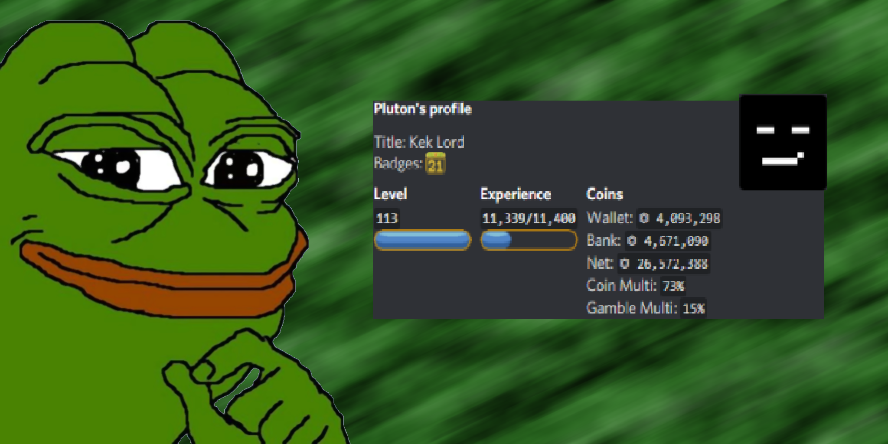

# 
 🐸 Best dank memer farmer 2022 🐸 

* fastest farmer in 2022
* auto beg, fish, dig and hunt
* macro detection bypass

## How to use
1. Run `pip install -r requirements.txt`
2. Put your token in [.env](.env)
3. Run [main.py](main.py)
4. Optional: change prefix (default Z)
5. Go to some channel and enter **Zfarm**
6. Farm is online, to stop, enter **Zstop**
7. To kill, close shell or enter **Zkill**

## Important
Due to discord Tos, ***Every slefbot that abuse the api is bannable***. this tool has a macro detection bypass but nothing is actually safe, __use at your own risk__.